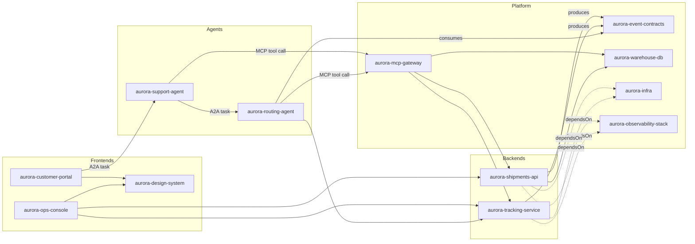

# ADR-0001: Satellite repository topology for the reference enterprise catalog

* Status: Accepted
* Date: 2026-09-18

## Context

This repository (`backstage`) is the **Backstage aggregator**: it hosts the
Backstage app instance (catalog, TechDocs, scaffolder templates, plugins)
that discovers and renders the software catalog for a hypothetical
enterprise. Its purpose is to be a realistic, end-to-end teaching example
that shows Backstage integrating with the kinds of systems a real platform
team actually deals with:

* REST APIs
* Protobuf/gRPC APIs
* AI agents speaking the [Agent2Agent (A2A) protocol](https://a2a-protocol.org/)
* Tool/context access for those agents via [MCP (Model Context Protocol)](https://modelcontextprotocol.io/) servers
* Event-driven messaging (Kafka)
* Databases
* Observability tooling (metrics, dashboards, alerting)
* Backend applications
* Frontend applications

A single monorepo containing all of this would not exercise the parts of
Backstage that make it valuable in a real organization: multi-repo catalog
discovery, per-team ownership boundaries, independent CI/CD and release
cadences, and cross-team `dependsOn`/`providesApis`/`consumesApis`
relationships. Backstage's catalog model assumes entities are scattered
across many repositories owned by many teams, so the example only
demonstrates the tool faithfully if the surrounding organization is modeled
the same way.

We therefore need to define, up front, which **satellite repositories**
this aggregator will discover, what each one represents, and how they map
onto Backstage catalog entities. The hypothetical enterprise for this
example is **Aurora Logistics**, a fictitious freight/logistics company
that ships packages, tracks them in real time, automates dispatch
decisions with AI agents, and offers both an internal ops console and a
customer-facing tracking portal.

## Decision

We will model Aurora Logistics as a GitHub organization, `aurora-logistics`,
containing the repositories below in addition to this aggregator. Every
satellite repo owns a `catalog-info.yaml` at its root (discovered via the
catalog's GitHub org-discovery processor pointing at `aurora-logistics`,
default branch), and this `backstage` repo owns the `System`/`Domain`/
`Group` entities that tie them together plus the scaffolder templates used
to stamp out new ones.

### Domain and System grouping

* **Domain**: `logistics-platform` (owns everything below)
  * **System**: `shipment-fulfillment` — order intake, warehouse state, REST surface
  * **System**: `fleet-tracking` — real-time tracking and routing/dispatch automation
  * **System**: `customer-experience` — customer- and operator-facing applications
  * **System**: `platform-engineering` — infra, messaging, data, and observability that everything else depends on

### Satellite repositories

| Repo | Stack | Catalog entities | System | Demonstrates |
| --- | --- | --- | --- | --- |
| `aurora-shipments-api` | Node.js/TypeScript, Express | `Component` (service) + `API` (`openapi`) | shipment-fulfillment | REST API cataloging, `api-docs` plugin, `providesApis` |
| `aurora-tracking-service` | Node.js, `@grpc/grpc-js` | `Component` (service) + `API` (`grpc`, `.proto` as definition) | fleet-tracking | Protobuf/gRPC API cataloging alongside REST, backed by a real runnable gRPC server (unary + server-streaming) |
| `aurora-routing-agent` | Python, A2A server SDK | `Component` (`type: agent`) + `API` (`type: a2a`, Agent Card at `/.well-known/agent.json`) | fleet-tracking | Cataloging an autonomous agent and its skills/Agent Card as a discoverable API |
| `aurora-support-agent` | Python, A2A client + server | `Component` (`type: agent`) + `API` (`type: a2a`) | customer-experience | Agent-to-agent orchestration (`consumesApis` another agent's A2A API), agents as first-class catalog citizens |
| `aurora-mcp-gateway` | TypeScript, `@modelcontextprotocol/sdk` | `Component` (`type: mcp-server`) + `API` (`type: mcp`, tool/resource manifest as definition) | platform-engineering | Governed tool/context access for LLM agents: wraps `aurora-shipments-api`, `aurora-tracking-service`, and `aurora-warehouse-db` behind auditable MCP tools instead of agents calling internal APIs directly |
| `aurora-event-contracts` | Avro/Protobuf schemas, AsyncAPI | `API` (`type: asyncapi`) + `Resource` (`type: kafka-topic`) per topic | platform-engineering | Kafka topic/schema contracts as catalog entities shared by producers and consumers |
| `aurora-warehouse-db` | Terraform + migrations (Postgres, Redis) | `Resource` (`type: database`, `type: cache`) | platform-engineering | Database/cache resources with `dependsOn` edges from the services that use them |
| `aurora-observability-stack` | Helm/Terraform (Prometheus, Grafana, Loki, Tempo, OTel Collector) | `Resource` (`type: observability`) | platform-engineering | `grafana`, Prometheus/alerting annotations surfaced on every component that depends on this resource |
| `aurora-infra` | Terraform/Kubernetes (cluster, Kafka via Strimzi, ingress) | `Resource` (`type: kubernetes-cluster`, `type: kafka-cluster`) | platform-engineering | Kubernetes plugin integration via namespace/cluster annotations |
| `aurora-ops-console` | React/Vite | `Component` (`type: website`) | customer-experience | Internal frontend consuming REST, gRPC-web, and Kafka (via a WS gateway) |
| `aurora-customer-portal` | Next.js | `Component` (`type: website`) | customer-experience | Customer-facing frontend embedding the support agent as a chat widget |
| `aurora-design-system` | React + Storybook | `Component` (`type: library`) | customer-experience | Shared frontend library consumed by both frontends, TechDocs for a library |

### Relationships (illustrative)

### Aggregator responsibilities (this repo)

* `catalog-info.yaml` files (or a single `org.yaml`) for the `logistics-platform`
  Domain, its four Systems, and the Aurora Logistics teams (`Group` entities:
  `team-shipments`, `team-fleet`, `team-ai-agents`, `team-platform`,
  `team-frontend`) plus their members (`User` entities).
* Catalog `LocationProcessor` config performing org-wide discovery against
  `aurora-logistics` so every satellite repo's `catalog-info.yaml` is picked
  up without manual registration.
* Scaffolder templates for the recurring shapes: REST service, gRPC service,
  A2A agent, MCP server, Kafka contract package, frontend app — so new
  satellite repos stay consistent with this topology.
* Aggregated TechDocs, `api-docs`, Kubernetes, and Grafana plugins wired to
  read the annotations each satellite repo publishes.

## Consequences

**Positive**

* Every integration point called out in the goal (REST, protobuf/gRPC, A2A
  agents, MCP tool servers, Kafka, databases, observability, backend apps,
  frontend apps) has a concrete, independently-ownable repo behind it, so
  the example reads as a real organization rather than a synthetic demo.
* Separating `aurora-mcp-gateway` from the agents themselves mirrors how
  enterprises actually govern LLM tool access: one auditable, centrally
  owned surface for "what can an agent touch", instead of every agent
  embedding its own ad hoc API clients and credentials.
* Cross-repo relationships (`dependsOn`, `providesApis`, `consumesApis`)
  are genuine multi-team, multi-repo edges, which is what actually
  exercises Backstage's catalog graph and ownership model.
* The System/Domain grouping gives a natural information architecture for
  the Backstage homepage and catalog filters.

**Negative / trade-offs**

* Thirteen repositories (including this one) is real overhead to scaffold,
  seed with plausible sample data, and keep CI-green; each needs at least a
  minimal working service/schema/UI, not just a `catalog-info.yaml` stub.
* Some satellite repos (e.g. `aurora-event-contracts`, `aurora-infra`) don't
  need to run anything — they exist purely to hold contracts/IaC — so their
  catalog entities are mostly `Resource`/`API` rather than `Component`,
  which should be made clear in their own `catalog-info.yaml` so they aren't
  mistaken for deployable services.
* A2A and MCP are both emerging protocols; Backstage has no first-party
  `API` type or plugin for either yet, so the agent and gateway repos will
  use custom `spec.type: a2a` / `spec.type: mcp` conventions (mirroring how
  `grpc` and `asyncapi` are already handled as community conventions)
  rather than built-in ones. This should be revisited if/when official
  support lands.
* Routing every agent's access to internal systems through
  `aurora-mcp-gateway` adds an extra hop and a repo that must stay in sync
  with the APIs it wraps (`aurora-shipments-api`, `aurora-tracking-service`,
  `aurora-warehouse-db`); its `providesApis`/`dependsOn` edges need to be
  kept accurate or the catalog will misrepresent what agents can actually
  reach.

## Alternatives considered

* **Single monorepo with multiple `catalog-info.yaml` files.** Rejected:
  it would demonstrate multiple catalog entities but not multi-repo
  discovery, independent ownership, or realistic `dependsOn` edges across
  repository and CI boundaries, which is a core part of what we want to
  showcase.
* **Static/mocked catalog entities with no real code behind them.**
  Rejected: entities without a working service, schema, or UI behind them
  can't demonstrate TechDocs generation, CI-driven catalog updates, or the
  API/Kubernetes/Grafana plugins actually rendering live data, which is
  most of the point of the example.
* **Fewer, more general-purpose repos** (e.g. one "backend" repo for both
  the REST and gRPC services). Rejected: collapsing the REST and gRPC
  services would obscure the fact that Backstage can catalog different API
  protocols side by side, which is one of the explicit goals.
