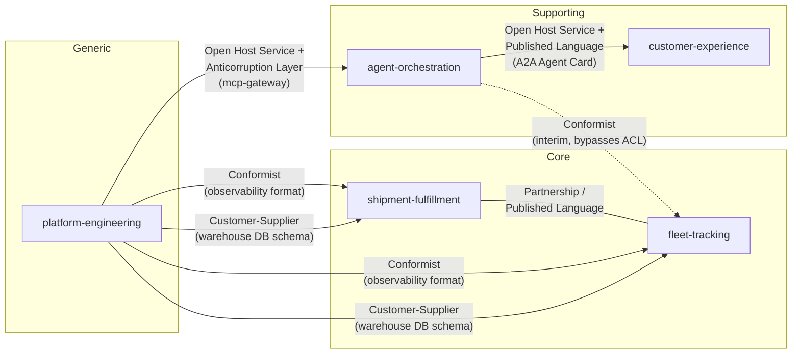

# Context map

How Aurora Logistics' bounded contexts (Backstage `System`s) relate to
each other, in DDD context-mapping terms. See
[ADR-0002](../adrs/0002-domain-driven-design-model.md) for the decision
behind this model and [the glossary](glossary.md) for each context's own
vocabulary. The relationships below are grounded in the real
`dependsOn`/`providesApis`/`consumesApis` edges already in the catalog
(see [ADR-0001](../adrs/0001-satellite-repository-topology.md)'s topology
table) — this diagram adds the *pattern*, not new edges.

## Relationships

| Upstream (Supplier) | Downstream (Consumer) | Pattern | Why |
| --- | --- | --- | --- |
| `platform-engineering` | `agent-orchestration` | Open Host Service + Anticorruption Layer | `aurora-mcp-gateway` is a single governed surface; agents are meant to never touch shipment/tracking internals directly (per ADR-0001's own stated rationale for the gateway's existence). |
| `platform-engineering` | `shipment-fulfillment`, `fleet-tracking` | Conformist | Both emit metrics/logs/traces in exactly the format `aurora-observability-stack` dictates — no translation, no negotiation. |
| `platform-engineering` | `shipment-fulfillment`, `fleet-tracking` | Customer-Supplier | For `aurora-warehouse-db`: schema and capacity are planned with the consuming teams' input, so downstream has real influence here — unlike the observability relationship above. |
| `shipment-fulfillment` | `fleet-tracking` | Partnership, via Published Language | Both teams co-evolve the event contracts in `aurora-event-contracts` (Avro/AsyncAPI); a Shipment's dispatch status flows one way and delivery outcomes flow back the other, so neither team can change the contract unilaterally. |
| `agent-orchestration` | `fleet-tracking` | Conformist — **flagged as interim, not the target state** | `aurora-routing-agent` still calls `tracking-api` directly (`consumesApis: tracking-api`) *in addition to* going through `mcp-gateway`, accepting Fleet Tracking's model as-is. This is a known gap: it should be routed entirely through the Anticorruption Layer like every other agent-to-internal-system call. |
| `agent-orchestration` | `customer-experience` | Open Host Service + Published Language | `aurora-support-agent`'s A2A surface is published at the standard, versioned `/.well-known/agent.json` location; the customer portal integrates via the public A2A protocol, not a bespoke contract. |

**Not present today:**

* **Shared Kernel** — no two bounded contexts jointly own a shared model.
  `aurora-design-system` is shared *code*, but it's single-team-owned
  (`team-frontend`), which is a reusable library, not a Shared Kernel in
  the DDD sense.
* **Separate Ways** — every context here integrates with at least one
  other; none has deliberately chosen to duplicate effort and avoid
  integration.

Both are left out deliberately rather than forced, since neither has a
genuine instance in this catalog today.
